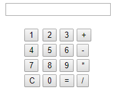

# Harlem Shake
Texto bailando
[Harlem-Shake](https://github.com/ComandPromt/Ejemplos-HTML/tree/master/harlem-shake)

# Calculadora

[Calculadora](https://github.com/ComandPromt/Ejemplos-HTML/blob/master/calculadora.html)

# Conversor de bytes

[Conversor de bytes](https://github.com/ComandPromt/Ejemplos-HTML/blob/master/conversor_bytes.html)

# Inches to cm

[Inches to cm](https://github.com/ComandPromt/Ejemplos-HTML/blob/master/inches_to_cm.html)

# Text 2 mp3
[Text 2 mp3](https://github.com/ComandPromt/Ejemplos-HTML/blob/master/text_2_mp3.html)

# Text 2 loquendo
[Text 2 loquendo](https://github.com/ComandPromt/Ejemplos-HTML/blob/master/texto_2_loquendo.html)

# Zonas horarias

[Zonas horarias](https://github.com/ComandPromt/Ejemplos-HTML/blob/master/zonas_horarias.html)

# Horario

[Horario](https://github.com/ComandPromt/Ejemplos-HTML/blob/master/horario.html)

# Tablas con CSS básico

[Tabla con CSS](https://github.com/ComandPromt/Ejemplos-HTML/blob/master/Ramon_tablas.html)
